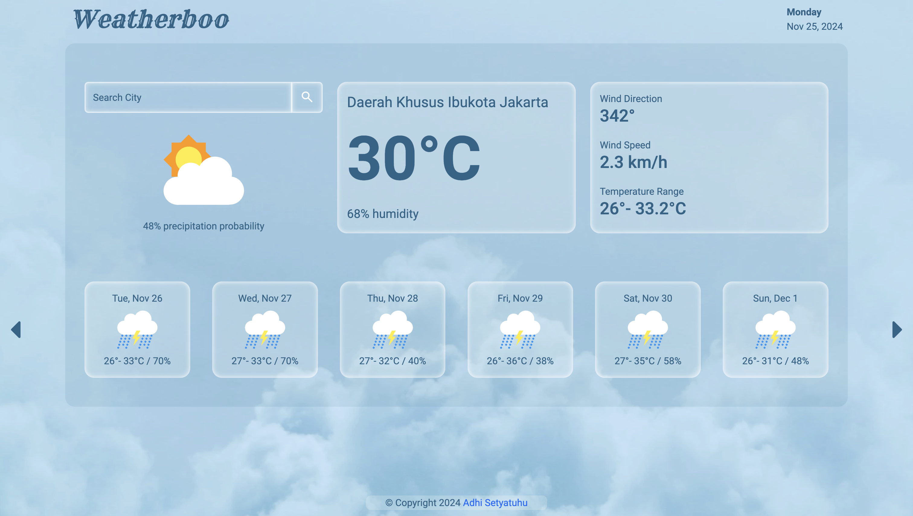

# weather-app
  
 
 
<a href="https://adhisetyatuhu.github.io/weather-app/" style="padding: 1em 2em; border: 1px solid #333; border-radius: 10px; text-decoration: none; background-color: rgba(40, 100, 136, 1); color: white; font-weight: bold;">Demo</a>
